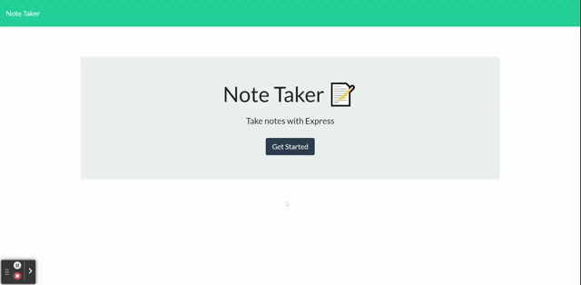

# note-Taker 

## Description 

This application utilizes the Express npm package to save, store, and delete notes. Applying Express to this application was a great way to gain experience on how the front-end connects to a back-end database. From the live Heroku link (another great learning experience), the user is taken to a main page, where they click a button to be taken to the note-taking page. From there, the user can then write, save, and delete notes, via the write (pencil), save (floppy disk), and delete (trash can) icons. See the GIF below for a demo!

## Table of Contents 📖

- [Technologies Used](#technologies-used-%EF%B8%8F)
- [Installation](#installation-%EF%B8%8F)
- [Usage Demo](#usage-demo)
- [License](#license-)

## Technologies Used 🖥️

| Technology  | Link                                   |
| ----------- | -------------------------------------- |
| Node.js     | https://nodejs.org/en/                 |
| Express     | https://www.npmjs.com/package/express  |

## Installation ⚙️

No need to install. Click the Heroku link below to be taken to the live application.

## Usage Demo

[Live Application Link](https://rocky-fjord-24025.herokuapp.com/)

## License 

MIT
